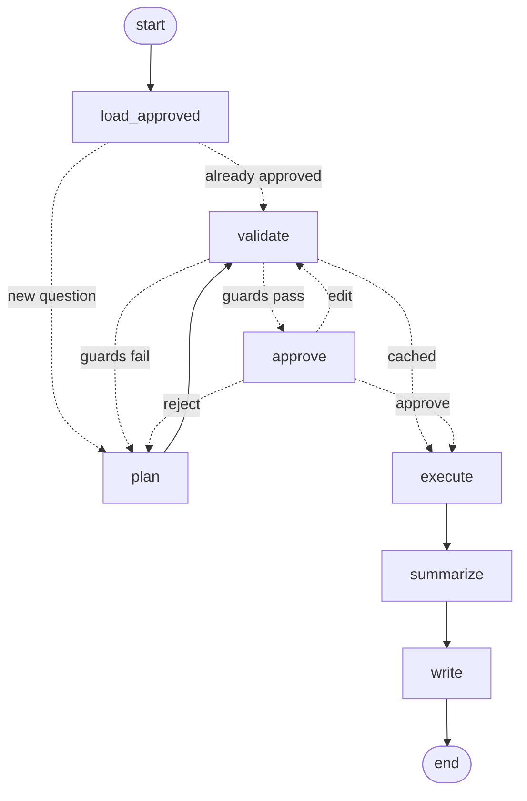

# Ask the Bookstore

Ask a question in plain English. The agent writes the SQL, **shows it to you
and waits**. You approve it, it runs, and the answer is saved with the exact
query that produced it.

Approve a query once and it's remembered — later runs replay it without
asking. A recurring report is supervised the first time and unattended after
that.

---

## Try it — 30 seconds, no API key

```bash
pip install -r requirements.txt
python seed.py          # builds bookstore.db from data/*.csv
python test_flow.py     # full run with the model stubbed out -> 10/10
```

`test_flow.py` uses the real graph, guards, SQL execution and file writing.
Only the LLM calls are scripted. It walks the awkward paths on purpose: a
blocked query, a rejection, an edit, then an approval.

## Run it for real

Copy `.env.example` to `.env` and set one of:

| Provider | Configuration |
|---|---|
| Anthropic | `ANTHROPIC_API_KEY=sk-ant-...` |
| OpenAI | `LLM_PROVIDER=openai` + `OPENAI_API_KEY=...` |
| Gateway (LiteLLM, vLLM, Azure proxy) | `LLM_PROVIDER=openai` + `LLM_BASE_URL=...` + `LLM_API_KEY=...` |
| Bedrock / Vertex | `LLM_PROVIDER=bedrock` or `vertex` |

```bash
python -m agent.llm --check    # confirms provider, model and connection
python main.py                 # menu: weekly report, or a single question
```

A full five-KPI report costs a few cents.

**On the key.** `main.py` needs one; `seed.py` and `test_flow.py` don't. If no
key is configured it prompts once per run via `getpass` — nothing echoes to
the screen, nothing lands in shell history. It then offers to store the key in
your OS keychain (macOS Keychain, Windows Credential Manager, Linux Secret
Service), after which you're never asked again:

```bash
python setup_key.py            # store it
python setup_key.py --show     # check what's stored (masked)
python setup_key.py --delete   # remove it
```

Resolution order is environment variable, then keychain, then prompt. The key
is never written into this folder on any of those paths and never enters the
graph state, so it can't reach a checkpoint, an output file, or a commit.
`.env` is gitignored if you prefer that route.

---

## What approval looks like

```
  Question: Which genre made the most revenue in 2025?

  Proposed query:

    SELECT b.genre, ROUND(SUM(oi.quantity * oi.unit_price), 2) AS revenue
    FROM order_items oi
    JOIN books b ON b.book_id = oi.book_id
    JOIN orders o ON o.order_id = oi.order_id
    WHERE o.order_date BETWEEN '2025-01-01' AND '2025-12-31'
    GROUP BY b.genre ORDER BY revenue DESC
    LIMIT 100

  [a] approve and run    [e] edit the SQL    [r] reject with feedback
```

**Reject** and your reason goes into the next attempt — a correction, not a
re-roll. **Edit** and your SQL goes back through the guards before you confirm
it.



---

## Guardrails

A prompt is a request, not a guarantee, so there are four layers:

1. **Prompt** — one `SELECT`; revenue must use `unit_price`, not the list
   price in `books` (a fifth of line items are discounted, so the wrong column
   returns plausible-looking but wrong numbers).
2. **Grounding** — the schema is read from `sqlite_master` at runtime, never
   hand-typed, so the agent can't drift from the real tables.
3. **Guards** (`agent/guards.py`, no LLM) — single statement, `SELECT`/`WITH`
   only, forbidden-keyword list, `LIMIT 100` if absent. Literals and comments
   are blanked first, so `WHERE title='Drop it'` passes and
   `SELECT 1; DROP TABLE books` doesn't. `python -m agent.guards` gives 12/12.
4. **Human** — the graph suspends at `interrupt()` before anything runs.

Plus a read-only SQLite connection. Cached approvals get no special trust:
stored SQL passes the guards on every run, so tampering with `approvals.json`
gets the entry discarded and sent back for review.

## Layout

```
data/           four CSVs - the committed source of truth
seed.py         builds the database from them (idempotent)
questions.yml   the five standing KPIs for the weekly report
approvals.json  queries a human has signed off, with timestamps
agent/          llm - guards - approvals - nodes - graph
main.py         menu, batch report, ad-hoc questions
outputs/        query.sql + result.csv + answer.md per run
```

```bash
python main.py --batch        # the weekly report
python main.py --approvals    # what's been approved, and when
python main.py --forget       # clear approvals, review everything again
```

Edit `questions.yml` to change what the report covers — no code changes.

## Limitations

`LIMIT` caps rows, not work — no query timeout or cost ceiling. The guards are
regex, not a SQL parser: fine for SQLite `SELECT`s, not a warehouse dialect.
Prompt injection is mitigated by the guards and the human, not eliminated.
`MemorySaver` is in-process, so a crash loses a paused run. Single-user CLI —
no scheduler, no identity beyond a timestamp.
